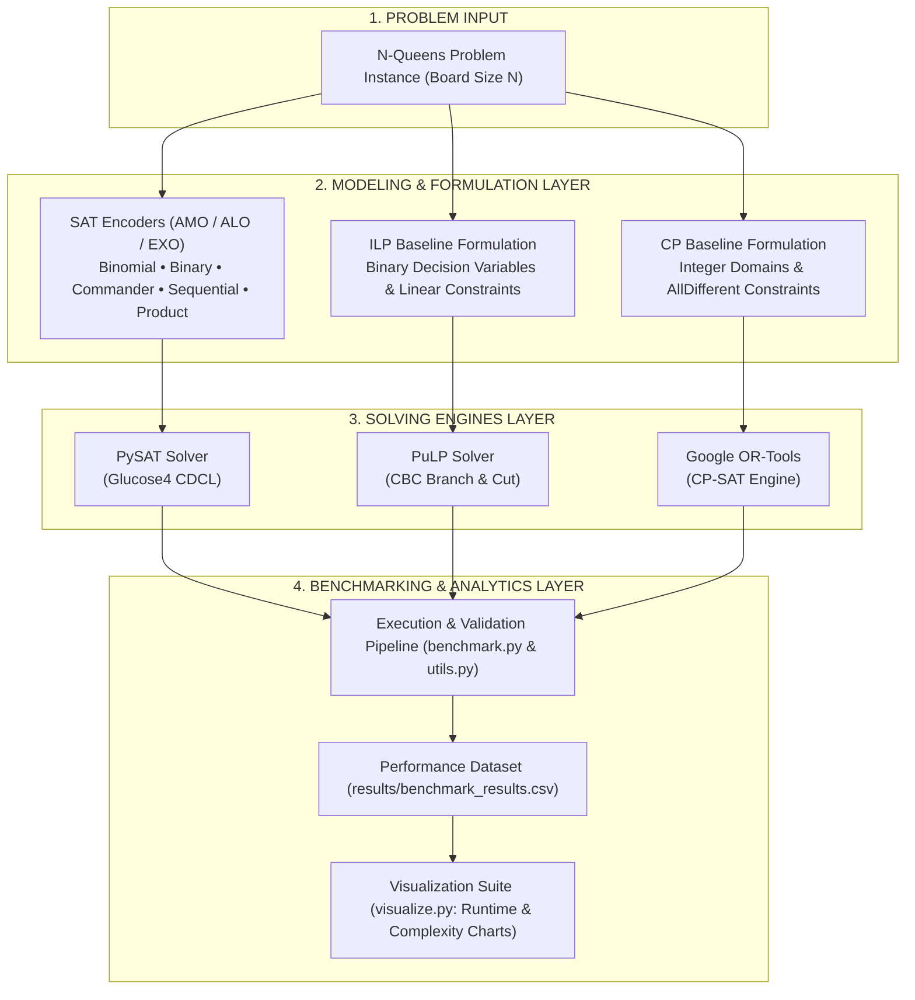

# N-Queens SAT Optimization

An optimized Boolean Satisfiability (SAT) approach for solving the N-Queens problem, accompanied by a comparative analysis against exact methods like Integer Linear Programming (ILP) and Constraint Programming (CP).

This repository contains the complete implementation, benchmarking tools, visualization scripts, and the final academic report for the assignment in the "Modern Issues in Computer Science" course.

## Introduction

The N-Queens SAT Optimization project provides a comprehensive research framework designed to evaluate and benchmark various SAT encoding strategies. By translating the N-Queens constraints into Conjunctive Normal Form (CNF) using multiple At-Most-One (AMO) encoding schemes, this project bridges theoretical combinatorial optimization with practical automated reasoning.

## Key Features

*   **Multiple SAT Encodings:** Five distinct AMO encoding schemes implemented from scratch: Binomial (Pairwise), Binary, Commander, Sequential Counter, and Product.
*   **Baseline Comparisons:** Native integration with PuLP (CBC) for ILP and Google OR-Tools for CP-SAT.
*   **Automated Benchmarking:** Execution pipelines utilizing ProcessPoolExecutor with resilient timeout handling for scaling up to N=200.
*   **Publication-Ready Visualizations:** Automated generation of comprehensive metrics (solving time, encoding time, formula complexity) using Matplotlib and Seaborn.

## Overall Architecture

The system architecture is organized into four cohesive layers: Problem Input, Modeling & Formulation, Solving Engines, and Benchmarking & Analytics. All SAT encodings inherit from a unified `NQueensEncoder` base class, strictly decoupling constraint generation from the solving logic.



## Installation

**Prerequisites:** Python 3.9 or higher and Git.

Clone the repository and install the required dependencies:

```bash
git clone https://github.com/Ohhalo02/nqueens-sat-optimization-01.git
cd nqueens-sat-optimization-01

# It is recommended to use a virtual environment
python -m venv venv
venv\Scripts\activate

# Install dependencies
pip install -r requirements.txt
```

## Running the Project

### 1. Quick Validation
Run the validation script to execute a quick test across all 7 solvers for small values of N. This will print the solved board directly to your console.

```bash
python nqueens_sat/test_validation.py
```

**Example Output:**
```text
============================================================
Testing: BinaryEncoder (N=4)
============================================================
  Solution Validated: TRUE
  Metrics: Vars=48 | Clauses=120 | Total Time=0.0004s
  Board:
  . Q . .
  . . . Q
  Q . . .
  . . Q .
```

### 2. Execute Benchmarks
To run the full suite of experiments and generate raw performance data:

```bash
python nqueens_sat/run_benchmark.py
```
*Note: Results will be appended to `nqueens_sat/results/benchmark_results.csv`.*

### 3. Generate Visualizations
To compile the CSV data into publication-ready graphs (PDF & PNG):

```bash
python nqueens_sat/visualize.py
```
*Output files will be saved in the `nqueens_sat/results/figures/` directory.*

## Folder Structure

```text
nqueens-sat-optimization-01/
├── nqueens_sat/
│   ├── baselines/          # Exact method integrations (ILP, CP)
│   ├── encoders/           # SAT Encoding implementations (Binary, Commander, etc.)
│   ├── results/            # Data & Visualization outputs
│   ├── benchmark.py        # ProcessPool execution pipeline
│   ├── visualize.py        # Analytics and plotting (Matplotlib/Seaborn)
│   └── utils.py            # Board rendering & constraint validation
├── report/                 # Academic LaTeX Source Files
│   ├── main.tex            # Elsevier standard manuscript
│   └── references.bib      # Citation database
├── README.md               # Documentation
└── requirements.txt        # Dependency lockfile
```

## License

This project is licensed under the MIT License.


